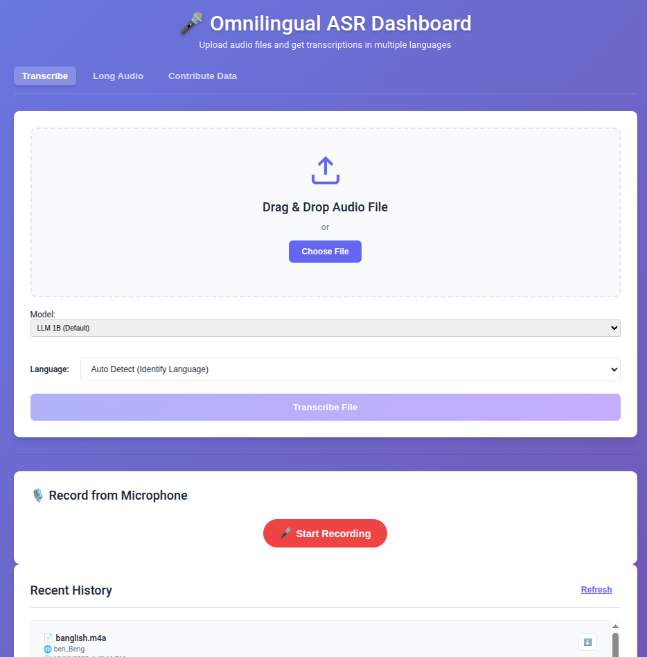

<div align="center">
  
</div>

# 🎙️ Omnilingual ASR Dashboard

Omnilingual ASR is a state-of-the-art speech recognition system supporting over **1,600 languages**. This dashboard provides a professional, user-friendly interface to leverage the power of Meta's Omnilingual ASR models for transcription, dataset collection, and model management.

---

## ✨ Key Features

- **🚀 Multi-Model Support**: Switch between different model architectures (LLM, CTC, etc.) and sizes (1B, 3B, 7B) on the fly.
- **🎙️ Live Microphone Transcription**: Record and transcribe audio directly from your browser with real-time visualization.
- **📄 Long Audio Processing**: Automatically handles large audio files by intelligent chunking, ensuring stable transcription for files of any length.
- **🌐 Global Language Coverage**: Support for 1,600+ languages with easy search and selection.
- **💾 Transcription History**: Securely save, review, and download your previous transcriptions.
- **🤝 Contribution Workflow**: Dedicated "Contribute" tab for data collection, allowing users to record specific prompts to help improve model performance for low-resource languages.

---

## 🚀 Quick Start

### Running the Dashboard
After installation, you can launch the dashboard using the dedicated virtual environment:

```bash
# From the project root
./asr_venv/bin/python app.py
```

- **URL:** [http://127.0.0.1:5000](http://127.0.0.1:5000)
- **Host Binding**: By default, the server binds to the local interface. For network-wide access, use the `--host` argument.

---

## 🛠️ Installation (Ubuntu 24.04 Optimized)

This project uses a standalone `venv` strategy to ensure ABI stability and manage complex CUDA dependencies.

### 1. System Requirements
```bash
sudo add-apt-repository ppa:deadsnakes/ppa
sudo apt update
sudo apt install python3.10-venv ffmpeg libsndfile1
```

### 2. Environment Setup
```bash
python3.10 -m venv asr_venv
./asr_venv/bin/pip install --upgrade pip
./asr_venv/bin/pip install torch==2.6.0 torchaudio==2.6.0 --index-url https://download.pytorch.org/whl/cu124
./asr_venv/bin/pip install fairseq2==0.6 fairseq2n==0.6 --extra-index-url https://fair.pkg.atmeta.com/fairseq2/whl/pt2.6.0/cu124
./asr_venv/bin/pip install -r requirements-dashboard.txt
./asr_venv/bin/pip install omnilingual-asr --no-deps
```

---

## 📁 Model Configuration

The system is designed to use local high-performance checkpoints.

### Model Cards
Models are managed via `fairseq2` asset cards located in `~/.config/fairseq2/assets/cards/models/omniasr_local.yaml`. This allows the dashboard to resolve identifiers (like `omniASR_LLM_1B_local`) to your local `.pt` files.

| Identifier | Parameters | Family |
|------------|------------|--------|
| `omniASR_LLM_1B_local` | 1B | LLM (Default) |
| `omniASR_CTC_1B_local` | 1B | CTC (High Speed) |
| `omniASR_LLM_3B_local` | 3B | LLM (High Accuracy) |

---

## ⚠️ Important Considerations

### 🎤 Microphone Privacy
Browsers only allow microphone access in **Secure Contexts** (HTTPS or localhost). If accessing the dashboard remotely via IP:
1. Use an **SSH Tunnel**: `ssh -L 5000:localhost:5000 user@remote-ip`
2. Or enable browser flags for insecure origins (e.g., `chrome://flags/#unsafely-treat-insecure-origin-as-secure`).

### ⚡ Conversion Performance
The dashboard uses system `ffmpeg` for audio conversion. Ensure `/usr/bin/ffmpeg` is available. If processing `.m4a` or `.mp3` files, the system will convert them to a model-compatible mono WAV format automatically.

---

## 📜 License & Citation

Omnilingual ASR is licensed under the Apache 2.0 License.

```bibtex
@misc{omnilingualasr2025,
    title={{Omnilingual ASR}: Open-Source Multilingual Speech Recognition for 1600+ Languages},
    author={Omnilingual ASR Team},
    year={2025},
    url={https://ai.meta.com/research/publications/omnilingual-asr-open-source-multilingual-speech-recognition-for-1600-languages/},
}
```
