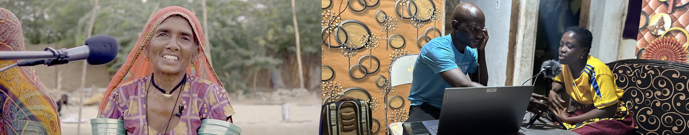
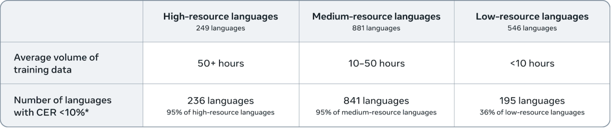

<div align="center">
  
  <p><i>Photographs captured during corpus creation efforts in Pakistan and Liberia.</i></p>
</div>

./asr_venv/bin/python app.py --help && ./asr_venv/bin/python app.py --port 5001 --debug

# Omnilingual ASR: Open-Source Multilingual Speech Recognition for 1600+ Languages

Omnilingual ASR is an open-source speech recognition system supporting over 1,600 languages — including hundreds never previously covered by any ASR technology. Designed for broad accessibility, it enables new languages to be added with just a few paired examples without requiring specialized expertise or large datasets. By combining scalable zero-shot learning with a flexible model family, Omnilingual ASR aims to make speech technology more inclusive and adaptable for communities and researchers worldwide.

* [Huggingface Demo](https://huggingface.co/spaces/facebook/omniasr-transcriptions)
* [Huggingface Dataset](https://huggingface.co/datasets/facebook/omnilingual-asr-corpus)
* [Paper](https://ai.meta.com/research/publications/omnilingual-asr-open-source-multilingual-speech-recognition-for-1600-languages/)
* [Blogpost](http://ai.meta.com/blog/omnilingual-asr-advancing-automatic-speech-recognition)

<div align="center">
  
  <p><i>Our 7B-LLM-ASR system achieves state-of-the-art performance across 1,600+ languages, with character error rates (CER) below 10 for 78% of those languages.</i></p>
</div>


## Documentation

### Quick Start
- **[Installation & Basic Usage](#installation)** - Setup and first transcription
- **[Inference Pipeline](src/omnilingual_asr/models/inference/README.md)** - Comprehensive transcription guide with batch processing, language conditioning, and context examples
- **[Supported Languages](#supported-languages)** - View the complete list of 1600+ supported languages


### Models & Architecture
- **[Model Specifications](#model-architectures)** - Available models, parameters, and memory requirements
- **[Architecture Overview](src/omnilingual_asr/models/README.md)** - Technical details on W2V, CTC, and LLM model families
- **[Asset Management](src/omnilingual_asr/cards/README.md)** - Configuration system for models, tokenizers, and datasets

### Training & Data Pipeline
- **[Data Preparation](workflows/dataprep/README.md)** - End-to-end guide for multilingual dataset preparation, HuggingFace integration, and parquet processing
- **[Training Recipes](workflows/recipes/wav2vec2/asr/README.md)** - Pre-configured workflows for CTC and LLM model training

---

## Installation

The models were developed using [fairseq2](https://github.com/facebookresearch/fairseq2), a research-focused sequence modeling toolkit. While we provide a **reference** inference pipeline that works across platforms, audio support requires [libsndfile](https://github.com/facebookresearch/fairseq2?tab=readme-ov-file#system-dependencies) (Mac: `brew install libsndfile`; Windows may need an additional [setup](https://github.com/facebookresearch/fairseq2?tab=readme-ov-file#installing-on-windows)).

```bash
# using pip
pip install omnilingual-asr

# using uv
uv add omnilingual-asr
```

## Inference

```python
from omnilingual_asr.models.inference.pipeline import ASRInferencePipeline

pipeline = ASRInferencePipeline(model_card="omniASR_LLM_7B")

audio_files = ["/path/to/eng_audio1.flac", "/path/to/deu_audio2.wav"]
lang = ["eng_Latn", "deu_Latn"]
transcriptions = pipeline.transcribe(audio_files, lang=lang, batch_size=2)
```

More details on running specific models can be found in the [src/omnilingual_asr/models/inference](/src/omnilingual_asr/models/inference/README.md) directory.

> **⚠️ Important:** Currently only audio files shorter than 40 seconds are accepted for inference. We plan to add support for transcribing unlimited-length audio files shortly.

### Supported Languages

To view the full list of 1600+ supported languages, you can access the language list [programmatically](/src/omnilingual_asr/models/wav2vec2_llama/lang_ids.py):

```python
from omnilingual_asr.models.wav2vec2_llama.lang_ids import supported_langs

# Print all supported languages
print(f"Total supported languages: {len(supported_langs)}")
print(supported_langs)

# Check if a specific language is supported
if "eng_Latn" in supported_langs:
    print("English (Latin script) is supported!")
```

Languages follow the format `{language_code}_{script}`, for example `eng_Latn` - English (Latin script), `cmn_Hans` - Mandarin Chinese (Simplified), ...

### Using the HuggingFace Dataset 🤗

We provide a large-scale multilingual speech dataset on HuggingFace under [CC-BY-4.0 License](./LICENSE-CC-BY-4.0.md): [`facebook/omnilingual-asr-corpus`](https://huggingface.co/datasets/facebook/omnilingual-asr-corpus).
This dataset can be directly used with our inference pipeline for evaluation or testing:

```bash
pip install "omnilingual-asr[data]"
```

```python
from datasets import load_dataset
from omnilingual_asr.models.inference.pipeline import ASRInferencePipeline

# Load dataset for a specific language (e.g., Ligurian)
omni_dataset = load_dataset("facebook/omnilingual-asr-corpus", "lij_Latn", split="train", streaming=True)
batch = next(omni_dataset.iter(5))

# Convert to pipeline input format
audio_data = [{"waveform": x["array"], "sample_rate": x["sampling_rate"]}
              for x in batch["audio"]]

# Run inference
pipeline = ASRInferencePipeline(model_card="omniASR_LLM_7B")
transcriptions = pipeline.transcribe(audio_data, batch_size=2)

# Display results
for i, (transcription, original_text) in enumerate(zip(transcriptions, batch["raw_text"]), 1):
    print(f"\n Sample {i}:")
    print(f"   Ground Truth: {original_text}")
    print(f"   Predicted:    {transcription}")
```


## Model Architectures
<!-- TODO : add new tokenizer, we'll get two tokenizer, add mssing speed numbers-->
| Model Name          | Features      | Parameters | Download Size (FP32) | Inference VRAM¹ | Real-Time Factor¹ (relative speed)² |
|---------------------|---------------|------------:|---------------:|---------------:|-----------:|
| [`omniASR_W2V_300M`](https://dl.fbaipublicfiles.com/mms/omniASR-W2V-300M.pt)      | SSL  | 317_390_592   | 1.2 GiB | | |
| [`omniASR_W2V_1B`](https://dl.fbaipublicfiles.com/mms/omniASR-W2V-1B.pt)          | SSL  | 965_514_752   | 3.6 GiB | | |
| [`omniASR_W2V_3B`](https://dl.fbaipublicfiles.com/mms/omniASR-W2V-3B.pt)          | SSL  | 3_064_124_672 | 12.0 GiB | | |
| [`omniASR_W2V_7B`](https://dl.fbaipublicfiles.com/mms/omniASR-W2V-7B.pt)          | SSL  | 6_488_487_168 | 25.0 GiB | | |
| [`omniASR_CTC_300M`](https://dl.fbaipublicfiles.com/mms/omniASR-CTC-300M.pt)      | ASR  | 325_494_996   | 1.3 GiB   | ~2 GiB  | 0.001 (96x) |
| [`omniASR_CTC_1B`](https://dl.fbaipublicfiles.com/mms/omniASR-CTC-1B.pt)          | ASR  | 975_065_300   | 3.7 GiB   | ~3 GiB  | 0.002 (48x) |
| [`omniASR_CTC_3B`](https://dl.fbaipublicfiles.com/mms/omniASR-CTC-3B.pt)          | ASR  | 3_080_423_636 | 12.0 GiB  | ~8 GiB  | 0.003 (32x) |
| [`omniASR_CTC_7B`](https://dl.fbaipublicfiles.com/mms/omniASR-CTC-7B.pt)          | ASR  | 6_504_786_132 | 25.0 GiB  | ~15 GiB | 0.006 (16x) |
| [`omniASR_LLM_300M`](https://dl.fbaipublicfiles.com/mms/omniASR-LLM-300M.pt)      | ASR with optional language conditioning  | 1_627_603_584 | 6.1 GiB   | ~5 GiB  | 0.090 (~1x) |
| [`omniASR_LLM_1B`](https://dl.fbaipublicfiles.com/mms/omniASR-LLM-1B.pt)          | ASR with optional language conditioning  | 2_275_710_592 | 8.5 GiB   | ~6 GiB  | 0.091 (~1x) |
| [`omniASR_LLM_3B`](https://dl.fbaipublicfiles.com/mms/omniASR-LLM-3B.pt)          | ASR with optional language conditioning  | 4_376_679_040 | 17.0 GiB  | ~10 GiB | 0.093 (~1x) |
| [`omniASR_LLM_7B`](https://dl.fbaipublicfiles.com/mms/omniASR-LLM-7B.pt)          | ASR with optional language conditioning  | 7_801_041_536 | 30.0 GiB  | ~17 GiB | 0.092 (~1x) |
| [`omniASR_LLM_7B_ZS`](https://dl.fbaipublicfiles.com/mms/omniASR-LLM-7B-ZS.pt)    | Zero-Shot ASR | 7_810_900_608 | 30.0 GiB | ~20 GiB | 0.194 (~0.5x) |
| [`omniASR_tokenizer`](https://dl.fbaipublicfiles.com/mms/omniASR_tokenizer.model) | Tokenizer for most of architectures (except omniASR_LLM_7B) | - | 100 KiB | - |
| [`omniASR_tokenizer_v7`](https://dl.fbaipublicfiles.com/mms/omniASR_tokenizer_v7.model) | Tokenizer for omniASR_LLM_7B model | - | 100 KiB | - ||

¹ (batch=1, audio_len=30s, BF16, A100)

² Relative speed to `omniASR_LLM_7B`


### Model Download & Storage

- **Automatic Download**: Models are automatically downloaded on first use during training or inference
- **Storage Location**: Models are saved to [`~/.cache/fairseq2/assets/`](https://facebookresearch.github.io/fairseq2/stable/basics/assets.html#the-asset-store-system)


### Architecture Documentation

We provide a high-level model architecture overview in the model directory ([`src/omnilingual_asr/models`](/src/omnilingual_asr/models)), with individual configurations for each model family in the respective directories:

- **SSL Models**: [`src/omnilingual_asr/models/wav2vec2_ssl`](/src/omnilingual_asr/models/wav2vec2_ssl/)
- **CTC Models**: [`src/omnilingual_asr/models/wav2vec2_asr`](/src/omnilingual_asr/models/wav2vec2_asr/)
- **LLM Models**: [`src/omnilingual_asr/models/wav2vec2_llama`](/src/omnilingual_asr/models/wav2vec2_llama/)

## Training

To further finetune the released checkpoints on your own data, use our [data preparation guide](/workflows/dataprep/README.md) followed by the [finetuning recipe guide](/workflows/recipes/wav2vec2/asr/README.md).

## License

Omnilingual ASR code and models are released under the [Apache 2.0](./LICENSE).

## Citation

If you use the omnilingual ASR model suite in your research and wish to cite us, please use the following BibTeX entry (arxiv version will be added soon)!
```bibtex
@misc{omnilingualasr2025,
    title={{Omnilingual ASR}: Open-Source Multilingual Speech Recognition for 1600+ Languages},
    author={{Omnilingual ASR Team} and Keren, Gil and Kozhevnikov, Artyom and Meng, Yen and Ropers, Christophe and Setzler, Matthew and Wang, Skyler and Adebara, Ife and Auli, Michael and Chan, Kevin and Cheng, Chierh and Chuang, Joe and Droof, Caley and Duppenthaler, Mark and Duquenne, Paul-Ambroise and Erben, Alexander and Gao, Cynthia and Mejia Gonzalez, Gabriel and Lyu, Kehan and Miglani, Sagar and Pratap, Vineel and Sadagopan, Kaushik Ram and Saleem, Safiyyah and Turkatenko, Arina and Ventayol-Boada, Albert and Yong, Zheng-Xin and Chung, Yu-An and Maillard, Jean and Moritz, Rashel and Mourachko, Alexandre and Williamson, Mary and Yates, Shireen},
    year={2025},
    url={https://ai.meta.com/research/publications/omnilingual-asr-open-source-multilingual-speech-recognition-for-1600-languages/},
}
```
